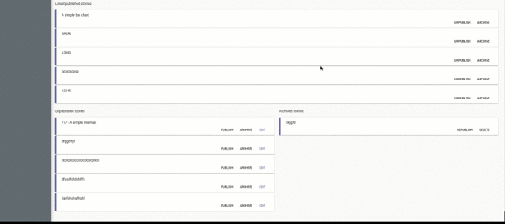

# apollo-cache-updater

[](https://github.com/diegohaz/nod)
[](https://npmjs.org/package/apollo-cache-updater)
[](https://travis-ci.org/ecerroni/apollo-cache-updater) [](https://codecov.io/gh/ecerroni/apollo-cache-updater/branch/master)


<p align="center">
  
</p>


<center>
Helper for updating the apollo cache after a mutation
</center>

## Status
Under heavy development

## Why?
I wanted an updater that steals the magic of refetch queries while keeping the power of apollo local cache, but stripped of the boilerplate usually needed for each mutation update.

Updating the local cache becomes exponentially complicated when it needs to:
- include multiple variables
- include multiple queries
- know which of our target queries has been already fired before our speficific mutation happend
- cover scenarios** where apollo's in-place update may not be sufficient

** Add/remove to list, move from one list to another, update filtered list, etc.

This solution tries to decouple the view from the caching layer by configuring the mutation's result caching behavior through the Apollo's `update` variable.

## Demo

<p align="center">
  
</p>


## Install

    $ npm install --save apollo-cache-updater

    OR 

    $ yarn add apollo-cache-updater

## Usage

Example: Add an Article

The following block of code:
- adds a new article to getArticles queries that contain the `published: true` variable
- adds `1` to the articleCounts queries that contain the `published: true` variable
```js
import ApolloCacheUpdater from "apollo-cache-updater";
import { getArticles, articlesCount } form '../../apollo/api'; // your apollo queries

createArticleMutation({ // your mutation
    variables: {
        ...articleVariables // your mutation vars
    },
    update: (proxy, { data: { createArticle = {} } }) => { // your mutation response        
        const mutationResult = createArticle; // mutation result to pass into the updater
        const updates = ApolloCacheUpdater({
            proxy, // apollo proxy
            queriesToUpdate: [getArticles, articlesCount], // queries you want to automatically update
            searchVariables: {
                published: true, // update queries in the cache that have these vars
            },
            mutationResult,
        })
        if (updates) console.log(`Article added`) // if no errors
    },
})
```
<hr />

Example: Remove an Article

The following block of code:
- removes an article with a specific id from the getArticles queries that contain the `published: true` variable
- subtract `1` from the articleCounts queries that contain the `published: true` variable
```js
removeArticleMutation({ // your mutation
    variables: {
        id: article.id // your mutation vars
    },
    update: (proxy }) => {
        const updates = ApolloCacheUpdater({
            proxy, // mandatory
            queriesToUpdate: [getArticles, articlesCount], // queries you want to automatically update
            searchVariables: {
                published: true, // update queries in the cache that have these vars
            },
            operation: 'REMOVE',
            mutationResult: { id: article.id },
        })
        if (updates) console.log(`Article removed`) // if no errors
    },
})
```
<hr />

### Advanced Usage

Example: Move an Article

The following block of code:
- removes an article from getArticles queries that contain the `published: true` variable and adds it to getArticles queries that contain the `published: false` variables
- adds `1` to the articleCounts that contain the `published: true` variable and adds it to articleCounts queries that contain the `published: false` variables
```js
setArticleStatus({
    variables: {
        _id: id,
        published: false, // set the published status to false
    },
    update: (proxy, { data: { setArticleStatus = {} } }) => {    
        const mutationResult = setArticleStatus;
        const updates = ApolloCacheUpdater({
            proxy, // mandatory
            operation: 'MOVE',
            queriesToUpdate: [getArticles, articlesCount],
            searchVariables: {
                published: true, // find the mutation result article that in the cache is still part of the queries with published = true and remove it
            },
            switchVars: {
                published: false, // add the mutation result article to the queries that in the cache were invoked with published = false, if any
            },
            mutationResult,
        })
        if (updates) console.log(`Article moved`)
    },
})
```

Complete configuration object
```js
{
    proxy, // mandatory
    searchOperator: '```AND```', // [```AND```, ```AND```_EDGE, OR, OR_EDGE], default ```AND```. If you need to match all searchVariables or just one at least
    searchVariables: {
        ...vars // searchVariables cannot be nested objects
    },
    queriesToUpdate: [...queries],
    operation: { // String || Object, default String ('ADD', 'REMOVE', 'MOVE', default: 'ADD')
        type: 'MOVE', // 'ADD', 'REMOVE', 'MOVE', default: ADD
        row: { // String || Object, default String ('TOP', 'BOTTOM', 'SORT', default: TOP)
            type: 'SORT', // 'TOP', 'BOTTOM', 'SORT', [SORT is effective only for ADD and MOVE], default: TOP
            field: 'createdAt', // if SORT, this indicates the field to be sorted
        },
    },
    switchVars: {
        ...otherVars, // switchVars cannot be nested objects
    },
    mutationResult, // mandatory
    ID: '_id', // Set the id field returned by your queries, default: id
}
````

#### Override default actions

For maximum flexibility you can also override the default actions of `ADD` and `REMOVE` operations.

Add 1 to all queries which data type is a number:

```js
    operation: {
        type: 'ADD',
        add: ({ query, type, data }) => {
            if (type === 'number') {
            return data + 1;
        }
    }
```

Pass a custom action for the query `articles`
```js
    operation: {
        type: 'ADD',
        add: ({ query, type, data }) => {
            if (query === 'articles') {
            return [mutationResult, ...data];
        }
    }
```

Use the custom add/remove if you want to:
- override the default behavior for arrays
- override the default behavior for numbers
- add a custom function to handle strings (not handled by default)
- affect other variables depending on the query data
- you have specific needs that default actions do not satisfy


Note:
- when using custom `add` and/or `remove` sorting is disabled and will be ignored even if you set it. It's up to you to do the sorting in the custom function
- if you do not return the mutated data (or it is undefined) the custom add/remove function's result will be skipped and default actions'result will be used instead. However the logic inside the custom function will always be executed.
- if the operation type is MOVE you need to pass both custom  `add` and `remove`. Passing just one of them will not work.

#### EDGE cases
There are edge situations where the cache includes queries like:
- articles({})
- articles({"sort":null,"limit":null,"start":null,"where":null})

This typically happen when a query with params like
```
query articles($sort: String, $limit: Int, $start: Int, $where: JSON) {
    articles(sort: $sort, limit: $limit, start: $start, where: $where) {
      _id
      title
      published
      flagged
    }
  }
```
gets called with either no variables object at all (variables object is not present) or a variables empty object has been passed, such as `variables: {}`. This may happen when variables are built programmatically.

`articles({})` and `articles({"sort":null,"limit":null,"start":null,"where":null})` are not handled by default and will be skipped, that is they will not be affected by the update.

However EDGE cases can be handled passing one of the EDGE searchOperator(s) such as ````AND```_EDGE` and `OR_EDGE`.

As an example using searchOperator: '```AND```_EDGE' the end result would be:
|                                                                | ADD(to published) | REMOVE(from published) | MOVE(from published to flagged) |
|----------------------------------------------------------------|-------------------|------------------------|---------------------------------|
| articles({"published":true})                                   | +1                | -1                     | -1                              |
| articles({"flagged":true})                                     | 0                 | 0                      | +1                              |
| articles({})                                                   | +1                | -1                     | +1/-1 (=no-change)              |
| articles({"sort":null,"limit":null,"start":null,"where":null}) | +1                | -1                     | +1/-1 (=no-change)              |

On the other hand queries with no variables included like:
```
query articles {
    articles {
      _id
      title
      published
      flagged
    }
  }
```
are not considered EDGE cases. If included in the `queriesToUpdate` array they will be always updated like the following despite searchOperator that is used:
|                              | ADD(to published) | REMOVE(from published) | MOVE(from published to flagged) |
|------------------------------|-------------------|------------------------|---------------------------------|
| articles({"published":true}) | +1                | -1                     | -1                              |
| articles({"flagged":true})   | 0                 | 0                      | +1                              |
| articles                     | +1                | -1                     | +1/-1 (=no-change)              |

In the unlikely case that `queriesToUpdate` contains exclusively queries with no paramaters, the `searchVariables` should be an emptyObject:
```
update: (proxy, { data: { createArticle = {} } }) => { // your mutation response        
        const mutationResult = createArticle;
        const updates = ApolloCacheUpdater({
            proxy,
            queriesToUpdate: [getArticlesNoParams, articlesCountNoParams],
            searchVariables: {},
            mutationResult,
        })
        if (updates) console.log(`Article added`)
    },
```
## License

MIT © [ric0](https://github.com/ecerroni)
